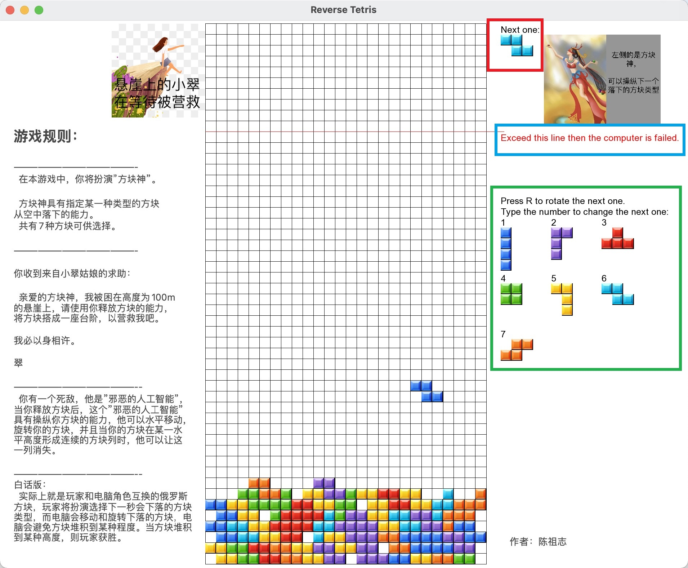

# 小游戏-"角色互换系列"-块方斯罗俄

这是本人设计和开发的小游戏"角色互换系列"-块方斯罗俄(别称："方块神大战人工智能")的源代码。

## 游戏玩法简介
本游戏是玩家和电脑角色互换的俄罗斯方块。在游戏中，玩家不再操控方块的旋转和降落，玩家将扮演选择下一秒会下落的方块的类型(共有7种)，而电脑会操纵当前下落方块的移动和旋转。
与传统俄罗斯方块类似，当某一行出现不间断的方块时，这一行就会被消除。

玩家的目的是通过选择下一秒下落的方块类型，使得最后堆叠的无法被消除的方块积累到一定高度，从而获胜。
(共有7种方块类型，通过键盘数字1,2,3,4,5,6,7指定下一个下落的方块的形态，通过键盘R可以指定下落时的初始角度)

电脑会通过算法选择方块的旋转形态和下落位置，算法会让堆叠起来的方块的高度尽可能低。

**
聪明的玩家朋友，发挥你的聪明才智，打败这个邪恶的电脑吧。**

## 界面介绍
UI界面见下图：
绿色框所包含的是玩家可以使用的方块类型，按下上面的键盘数字即可指定下一个下落的方块为对应的类型。
红色框为下一个要落下的方块类型。
蓝色的方框所对应的线是玩家获胜的高度。

如果玩家获胜，将会出现下列节面

 

## 程序简介

程序包含以下几大模块：
PLayerBoard：游戏面板模块，用于打印游戏UI面板，包括游戏规则、网格图、玩家选择的方块类型、所有方块类型列表等。
Field：用于网格中已经固定了的方块，主要功能包括保存当前网格中的哪些格子里是有方块的、检测是否需要对某一行进行消除、将当前下落到底部的方块固定到网格中等。
SingleTetris：表示单个"方块体"，包括7种形态，主要功能包括对方块体的位置进行移动，旋转等。
TetrisAI：游戏人工智能，用于判断当前下落的方块应该在哪个位置落下、该以哪种旋转姿态落下。
Game：游戏的控制主题，包含 当前正在下落的方块(SingleTetris实例)、当前网格中已经固定的方块(Field实例)、游戏人工智能(Tetris实例)。主要功能会根据键盘输入更新游戏状态，包括调用游戏AI决定方块该放在哪个位置、释放新的方块、对当前下落的方块发出移动和旋转指令。

程序的主体逻辑如下：
''
while (window.isOpen())
    {
        sf::Time elapsed = get_elapsed_time();

        sf::Int32 elapsed_time = min(elapsed.asMilliseconds(), 100);

        while (window.pollEvent(event))
        {
        //处理键盘输入
            switch (event.type)
            {
            //关闭游戏
            case sf::Event::Closed:
                window.close();
                break;
            case sf::Event::KeyPressed:
                switch (event.key.code)
                {
                //数字输入, 表示要改变下一个落下的方块类型
                case sf::Keyboard::Num1:
                case sf::Keyboard::Num2:
                case sf::Keyboard::Num3:
                case sf::Keyboard::Num4:
                case sf::Keyboard::Num5:
                case sf::Keyboard::Num6:
                case sf::Keyboard::Num7:
                    game.ProcessPressNumber(event.key.code);
                    break;
                //表示要旋转下一个落下的方块的初始形态
                case sf::Keyboard::R:
                    game.ProcessPressR();
                    break;
                }
                break;
            }
        }
        //更新游戏
        game.Update(elapsed_time);

        window.clear();
        window.draw(game);
        window.display();
        
        //等待上一帧打印完毕
        Sleep(16);
    }
''

## 为什么叫"方块神大战人工智能"？
因为我想了一个该游戏的背景故事：
在本游戏中，你将扮演”方块神”。
方块神具有指定某一种类型的方块从空中落下的能力。 共有7种方块可供选择。
某一天，方块神收到了一封来自小翠姑娘的求救信：
_
亲爱的方块神，我被困在高度为100m
的悬崖上，请使用你释放方块的能力，
将方块搭成一座台阶，以营救我吧。

我必以身相许。

翠
_

于是，你决定动用你释放方块的能力，用方块搭出一个梯子(只需要达到100m高度即可)，以营救小崔。

然而，你有一个死敌，他是”邪恶的人工智能”，当你释放方块后，这个”邪恶的人工智能”具有操纵你方块的能力，他可以水平移动，旋转你的方块，并且当你的方块在某一水平高度形成不间断的方块列时，他可以让这
一列消失。

所以，英勇的勇士啊，快来营救你心爱的姑娘吧!

(写得我都尬了)
